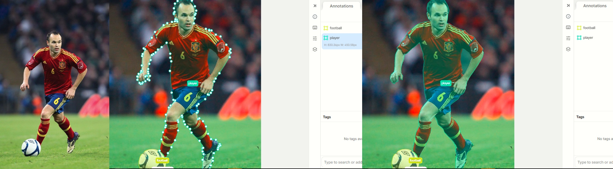

# AI Evaluation, Data Annotation and Computer Vision Portfolio

# About Me

**Hello! I'm Mehvish Sami, an AI Evaluation and Data Annotation Specialist passionate about improving AI systems through high-quality evaluation, annotation, and quality assurance.I work on AI-generated task evaluation, annotation review, correction and computer vision datasets to support accurate and reliable AI systems.**

---
## Skills & Expertise

*  AI Evaluation
*  Data Annotation
*  Annotation Quality Assurance (QA)
*  AI Agent Testing
*  Annotation Error Detection & Correction
*  Computer use and screen based tasks
*  Video Annotation & action Verification
*  AI Agent Testing & Evaluation

---
# Projects

1. AI Evaluation & Text Annotation
2. Image Annotation & Computer Vision
3. Video Annotation & Verification
4. AI Agents & Computer Use

# 1. AI Evaluation & Text Annotation

## 1.1 Content Moderation

### Skills Demonstrated

* Content Review
* Policy & Guideline Compliance
* Content Classification
* AI Evaluation
* Annotation Quality Assurance
* Annotation Guideline Application

## 1.2 Sentiment Analysis

### Skills Demonstrated

* Sentiment Classification
* Text Annotation
* Data Labeling
* NLP Dataset Preparation
* Annotation Quality Assurance

 

 ## 1.3 Named Entity Recognition (NER)
  Tool: LabelBox
  ### Project Summary
Annotated text data by identifying and labeling entities such as People, Organizations, Locations, Dates, and other relevant entities. The annotations were reviewed for accuracy and consistency to support high-quality NLP datasets and AI systems.

### Skills Demonstrated

* Named Entity Recognition (NER)
* Text Annotation
* Entity Classification
* Annotation Quality Assurance (QA)

 
    
### Quality Assurance Approach

---

* Apply predefined sentiment guidelines
* Distinguish between positive, negative, and neutral expressions
* Review ambiguous statements carefully
* Maintain consistency across annotations
* Validate labels before dataset submission
---

# 2. Image Annotation Projects

## 2.1 Vehicle & Object Annotation
Annotation Type: Bounding Box object annotation

Tool: CVAT, V7, Labelbox, LabelImg, 
**Classes Annotated:**
* Car
* Bus
* Van
* Bike
* Person
* Road Sign

### Project Summary
Annotated traffic scene images by creating accurate bounding boxes around vehicles, pedestrians, and other relevant objects and assigning the appropriate class labels according to project guidelines. The annotations were prepared for computer vision dataset development and model evaluation.

### Work Performed:

* Identified target objects in images
* Assigned appropriate object classes
* Reviewed annotations for errors
* Maintained consistency across large datasets

### Skills Demonstrated

* Bounding box quality control
* Multi-Class Object Detection
* Crowd Annotation
* Vehicle identification
* Pedestrian identification

   
   
   
   

 ## 2.2 Image Segmentation & Polygon Annotation
Annotation Type: Polygon & Segmentation Annotation       

Tool: V7/CVAT

### Project Summary
Annotated diverse real-world images using precise polygon, segmentation, and keypoint annotation to create high-quality Computer Vision datasets. Focused on accurate object boundaries, human contours, and annotation consistency to support AI models in object detection, segmentation, tracking, and scene understanding.

### Challenges Faced:

* Complex object boundaries
* Overlapping & occluded objects
* Small and distant objects
* Consistent annotation across scenes
* Accurate human contours & keypoints

### Skills Demonstrated

* Polygon & Segmentation Annotation
* Keypoint Annotation
* Object Boundary Precision
* Human Contour & Pose Annotation
* Multi-Class Labeling
* Occlusion Handling
* Annotation Quality Assurance
* Computer Vision Data Annotation

• Sports & Player Annotation   • Traffic & Transportation Annotation   • Indoor & Kitchen Annotation 

# 3. AI Agents & Computer Use

## Video Annotation & action Verification

### Project Summary
Reviewed and verified video annotations to ensure that objects, actions, descriptions, and their sequence accurately matched the visual content. This process helped maintain high-quality, consistent training data for AI systems that learn to understand activities and events in video.

### Challenges Faced

* Identifying ambiguous or unclear actions.
* Detecting description and sequence mismatches.
* Handling partially visible or overlapping objects.

### Skills Demonstrated

* Video Annotation
* Action & Object Verification
* Sequence Verification
* Description Verification
* Video QA
* Error Detection
* QA & Feedback
* AI/ML Data Quality

  

  

