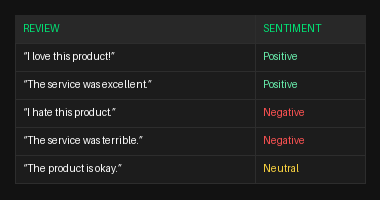

# AI Evaluation, Data Annotation and Computer Vision Portfolio

# About Me

**Hello! I'm Mehvish Sami, an AI Evaluation and Data Annotation Specialist passionate about improving AI systems through high-quality evaluation, annotation, and quality assurance.I work on AI-generated task evaluation, annotation review and correction, and computer vision datasets to support accurate and reliable AI systems.**

---

## Skills & Expertise

*  AI Evaluation
*  Data Annotation
*  Annotation Quality Assurance (QA)
*  Computer Use Agent Tasks
*  Annotation Error Detection & Correction
*  Computer use and screen based tasks
*  Video Annotation & action Verification
*  AI Agent Testing & Evaluation
*  Dataset reation & Validation
*  Computer Vision Model Training

---

# AI Evaluation & Text Projects

## 1. Content Moderation

### Skills Demonstrated

* Content Review
* Policy & Guideline Compliance
* Content Classification
* AI Evaluation
* Annotation Quality Assurance
* Annotation Guideline Application

## 2. Sentiment Analysis

### Skills Demonstrated

* Sentiment Classification
* Text Annotation
* Data Labeling
* NLP Dataset Preparation
* Annotation Quality Assurance

 
### Quality Assurance Approach

---

* Apply predefined sentiment guidelines
* Distinguish between positive, negative, and neutral expressions
* Review ambiguous statements carefully
* Maintain consistency across annotations
* Validate labels before dataset submission
---

# Image Annotation Projects

## 1. Vehicle & Object Annotation
Annotation Type: Bounding Box object annotation

Tool: CVAT, V7, Labelbox, LabelImg, Classes Annotated

* Car
* Bus
* Van
* Bike
* Person
* Road Sign

### Project Summary
Annotated traffic scene images by creating accurate bounding boxes around vehicles, pedestrians, and other relevant objects and assigning the appropriate class labels according to project guidelines. The annotations were prepared for computer vision dataset development and model evaluation.

### Work Performed:

* Identified target objects in images
* Assigned appropriate object classes
* Reviewed annotations for errors
* Maintained consistency across large datasets

### Skills Demonstrated

* Bounding box quality control
* Multi-Class Object Detection
* Bounding box annotation
* Crowd Annotation
* Vehicle identification
* Pedestrian identification
* Occlusion Handling
* Dataset validation

   
  
   

  

